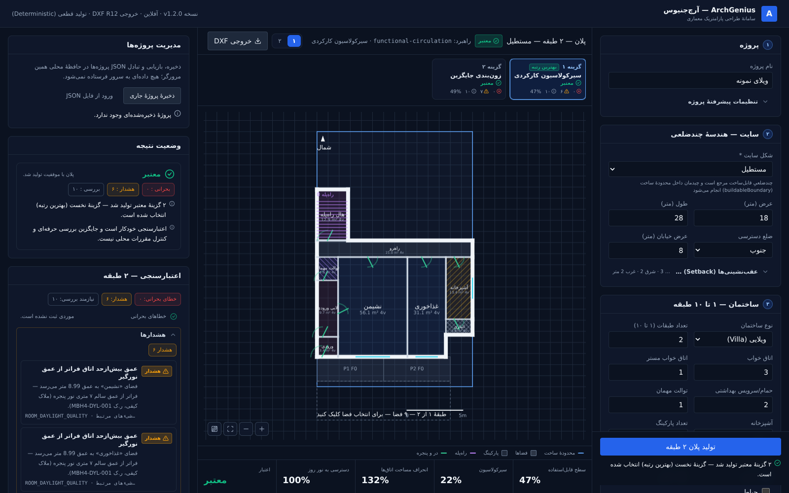

# ArchGenius V1 — Portfolio Overview

ArchGenius is an offline, deterministic residential floor-plan generator with a CAD export.
From a parametric project description (site, setbacks, building programme, seed), it
generates candidate floor plans, validates them, ranks them, and exports the selected plan
as an editable AutoCAD R12 ASCII DXF file.

The web UI is in Persian (RTL) and targets residential design in Iran. This document is
the English overview; the full Persian README is [../README.md](../README.md).



*Default project in the web UI (18 × 28 m site, 2 floors, 3 bedrooms, 2 parking spaces). The
engine returns two valid candidates; the selected candidate has 0 HARD findings. Screenshot
taken from the running V1 app.*

---

## What it does

| Stage | What happens |
|---|---|
| Site geometry | Site boundary, user setbacks (N/S/E/W) → buildable area; parking band reserved on the access side |
| Programme | Bedrooms / master bedrooms / bathrooms / WC / kitchen type / storage / parking / stair / elevator shaft / optional balcony and yard → a list of spaces with target and minimum areas and a constraint graph (adjacency, direct access, separation) |
| Generation | Four strategies (`area-efficiency`, `functional-circulation`, `daylight-orientation`, `alternative-zoning`), each a bounded placement search; 1–10 floors with a stacked stair core |
| Validation | Every candidate gets HARD / SOFT / ADVISORY findings: geometry, site containment, circulation, stair / elevator, furniture and the regulation rules |
| Ranking | One deterministic comparator: fewest HARD findings, then fewest SOFT findings, then the weighted quality metrics, then strategy order |
| Output | DXF (in the UI), plus PDF / XLSX / QA report / manifest from the core API |

## Engineering highlights

- **Deterministic geometry engine.** The same input and seed always give the same plan,
  findings and DXF bytes. There is no randomness in geometry generation, all searches are
  bounded, and determinism is asserted by tests and by the layout regression harness.
- **Polygon-authoritative model.** `Space.polygon` is the source of truth (`rect` is derived).
  There is no silent bounding-box fallback: failures produce explicit findings.
- **Honest infeasibility.** If no candidate meets the geometric minimums, the result is an
  explicit `INFEASIBLE` state (`bestCandidate = null`) with per-strategy reasons. A plan
  that doesn't work is never presented as a normal one, and DXF export refuses diagnostic
  candidates.
- **Editable CAD output.** The DXF is AutoCAD R12 ASCII (`$ACADVER = AC1009`). It uses real
  CAD entities (POLYLINE, LINE, ARC, TEXT) on named, per-floor layers (`A-FLOOR-{n}-{base}`, e.g.
  `A-FLOOR-0-A-DOOR`, `A-FLOOR-0-A-ROOM`, `A-FLOOR-0-A-DIMS`), with millimetre coordinates (R12 has
  no `INSUNITS` variable). Every file is structurally validated by the internal DXF parser
  before delivery. Three golden DXF fixtures are checked byte for byte (size + SHA-256). See
  [DXF_ENGINE.md](DXF_ENGINE.md) and [DXF_R12_COMPATIBILITY.md](DXF_R12_COMPATIBILITY.md).
- **Regression discipline.** `packages/core/scripts/layout-regression.mjs` compares any
  candidate build with a baseline commit over a 32-case benchmark (128 strategy rows) and a
  560-case sweep (2240 rows). It checks validity, HARD codes, parking stalls, stair-core
  alignment, determinism and best-candidate DXF bytes. See [LAYOUT_REGRESSION.md](LAYOUT_REGRESSION.md).
- **Opt-in experimental planner.** The coordinated rectangle planner (`coordinatedRectPlanner`,
  phases P1–P10) is an API-level option, **off by default**. It is adopted per strategy only
  through a strict guard; with it off, the output is byte-identical to the legacy engine.

## Regulation-source architecture (and its limits)

- Rules carry an explicit status: `VERIFIED`, `REQUIRES_SOURCE_VERIFICATION`, `NOT_IMPLEMENTED`
  or `DEPRECATED`. A rule is `VERIFIED` only when it is matched to page / clause / text of a
  Tier-1 source document registered with its SHA-256 hash in [`sources/`](../sources/README.md).
- Two Tier-1 documents are registered: Iranian National Building Regulations **Mabhas 4**
  (1396) and **Mabhas 15** (1392). Nine rules are currently `VERIFIED`
  ([REGULATIONS.md](REGULATIONS.md), [REGULATION_AUDIT.md](REGULATION_AUDIT.md)).
- Municipal packs (setbacks, local parking, detailed plans) are placeholders: no municipal
  source has been obtained, so no municipal threshold is presented as verified. User setbacks
  are design inputs, not legal commitments.
- **ArchGenius does not claim regulatory compliance, municipal approval or certification.**
  Validation supports design review; it does not replace review by a qualified professional.

## V1 scope

- **Rectangle sites only.** The UI offers rectangle sites only, and the core rejects other
  site geometry with `UNSUPPORTED_SITE_GEOMETRY`. The L-shape / orthogonal-polygon planner
  code is kept but dormant.
- Villa typology, 1–10 floors. Apartment is a first slice only (one full unit per floor, no
  shared cores or multi-unit layouts).
- Web UI exports DXF. PDF, XLSX, QA report and manifest are available from the core API only.

## Known limitations

- Some site / programme combinations are honestly `INFEASIBLE` (for example narrow or small
  sites with a large programme). The UI reports this with the reasons; it never shows an
  invalid plan as valid.
- Valid plans can still carry SOFT findings. Known recurring ones: circulation ratio slightly
  above the 35 % guideline on some narrow multi-floor plans, deep living rooms beyond the 7 m
  daylight depth on wide sites, and intentional open residual space.
- Elevator shaft dimensions are design assumptions (rule MBH15-LIFT-002 is `NOT_IMPLEMENTED`).
- North rotation is a model field only; the layout and DXF engines don't use it.
- Family room / guest room flags exist in the core but are not exposed in the UI.
- The UI is Persian-only. No 3D / BIM / DWG / image import.

Full lists: [README §10](../README.md) and [RELEASE_NOTES.md](../RELEASE_NOTES.md).

## Run the demo

Requirements: Node.js ≥ 20.

```bash
npm ci
npm run dev          # web UI at http://localhost:5173
```

In the UI, click the blue **Generate** button (تولید پلان) with the default form. The
result panel shows the valid candidates, the plan preview (pan / zoom, click a room for its
dimensions), the floor picker and the validation panel. The **DXF** button (خروجی DXF)
downloads the plan as an R12 DXF.

Engineering checks:

```bash
npm run typecheck    # core + web, TypeScript strict
npm run build        # core (tsc) + web (Vite)
npm test             # core + web test suites (vitest)
npx vitest run src/regression/golden-dxf.test.ts   # in packages/core — golden DXF fixtures
```

Verified at commit `41bff3e`: core 1928 tests (105 files) and web 218 tests (13 files) pass.
Typecheck and build pass, and the GitHub Actions CI workflow passed on that commit.

## Repository map

```
packages/core   @archgenius/core — engine (TypeScript, ESM): site, programming, layout,
                generator, validation, intelligence, regulations, dxf, documentation, editing
packages/web    @archgenius/web — React + Vite + Tailwind UI (Persian, RTL)
docs/           engine documentation; docs/history/ holds the phase-by-phase development reports
sources/        Tier-1 regulation documents + source registry
outputs/        preserved DXF investigation artefacts referenced by DXF_R12_COMPATIBILITY.md
```
